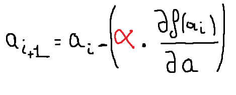
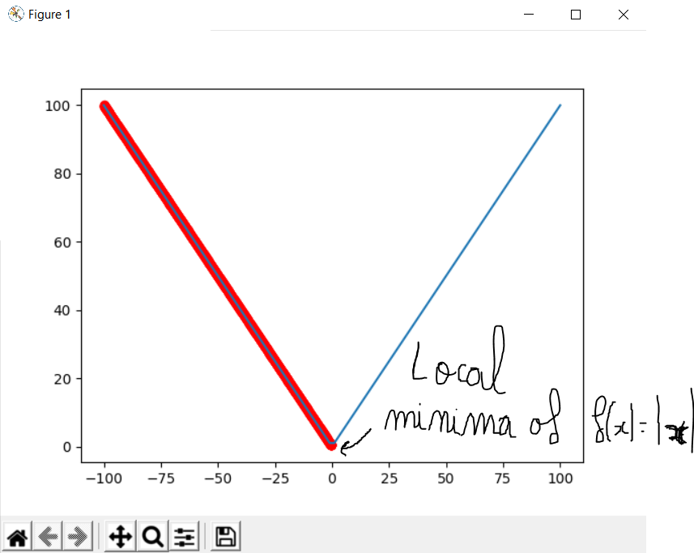

# Gradient-Descent
Vulgary algorithm using Gradient descent for "Local minima" finding  ( 2 dimentional space )

(k-dimentional spaces needs gradient derivatives)

variable 'f' is the function

variable 'alpha' is the hyperparameter OR learning rate in machine learning OR the step in mathematics

LittleYounes
